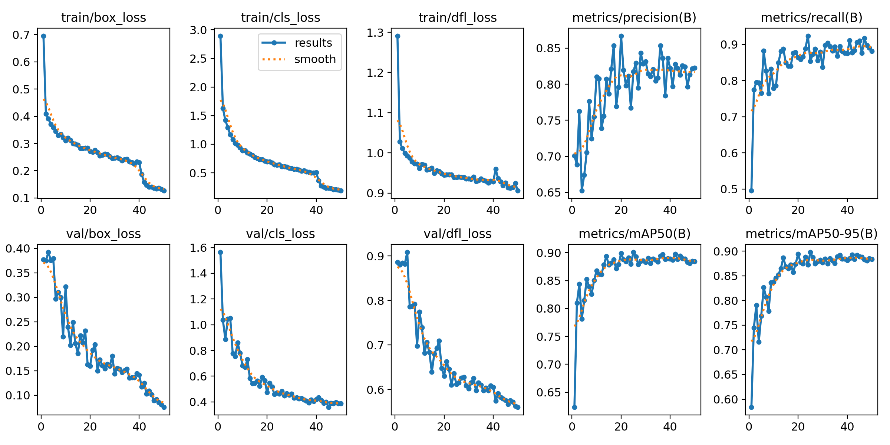
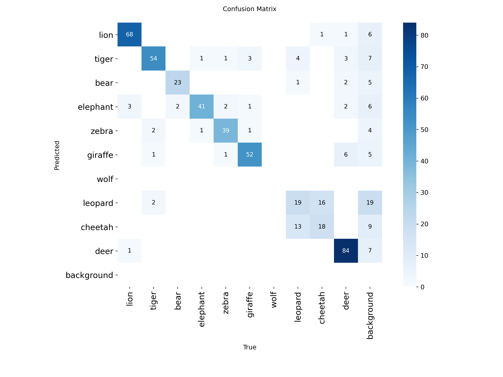
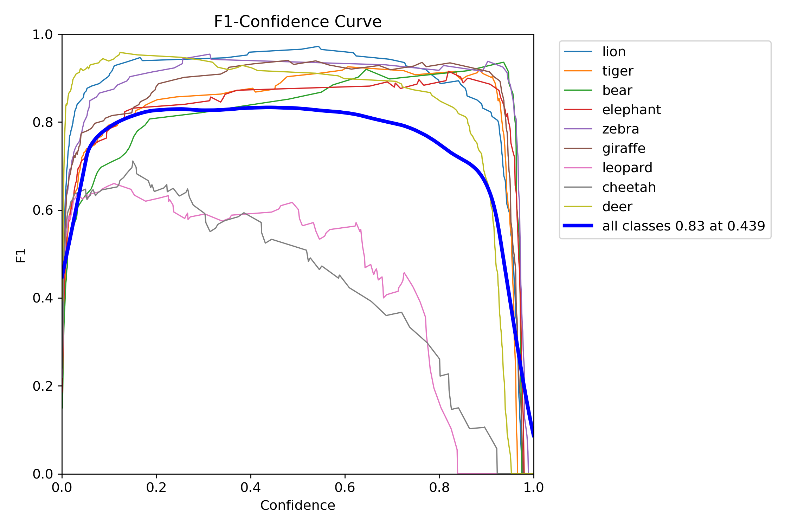
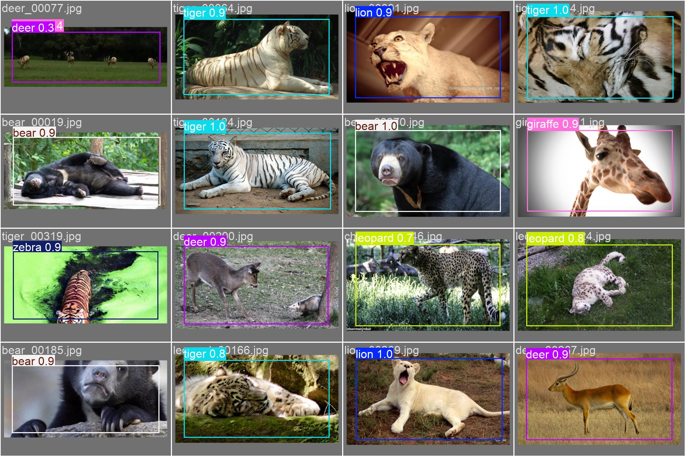

# Animal Detection System 🦁🐯🐻

## 📘 Problem Statement
In the field of wildlife monitoring and public safety, automating the detection of dangerous animals is crucial. This project aims to build a robust **Animal Detection System** capable of identifying and classifying varying species of animals in real-time or from static images.

The primary objective is to accurately distinguish between **Carnivores** (specifically potentially dangerous ones like Lions, Tigers, Bears) and **Herbivores/Others**. This system can be deployed in surveillance systems to alert authorities of potential wildlife encrouchment.

## 📂 Dataset
The model is trained on a curated dataset consisting of **10 distinct classes**:
-   **Carnivores**: Lion, Tiger, Bear, Wolf, Leopard, Cheetah, Hyena, Crocodile, Shark.
-   **Herbivores/Other**: Elephant, Zebra, Giraffe, Deer.

The dataset contains labeled images properly split into:
-   **Training Set**: Used for model learning.
-   **Validation Set**: Used for hyperparameter tuning and metric evaluation.
-   **Test Set**: Used for final performance assessment.

## ⚙️ Methodology

### 1. Model Selection
We utilized **YOLOv8 (You Only Look Once term 8)**, a state-of-the-art object detection model known for its speed and accuracy.
-   **Architecture**: YOLOv8n (Nano) was chosen for its lightweight nature, allowing for real-time inference on standard hardware.
-   **Transfer Learning**: We leveraged pre-trained COCO weights to speed up convergence and improve feature extraction capabilities.

### 2. Preprocessing & Augmentation
-   **Image Resizing**: All images are resized to 640x640 pixels (standard YOLO input) to ensure consistent input dimensions.
-   **Feature Scaling**: Pixel values are normalized to the [0, 1] range to facilitate stable training convergence.
-   **Augmentation**: To improve generalization and prevent overfitting, we applied:
    -   **Mosaic**: Combines 4 training images into one, helping the model learn to detect objects at different scales and context.
    -   **Random brightness/contrast**: Simulates various lighting conditions.
    -   **Horizontal flips**: Increases dataset diversity.

### 3. Project Structure
The repository is organized as follows:
```
Animal_Detection/
├── config/             # Configuration files (colors, thresholds)
├── data/               # Dataset and YAML definitions
├── models/             # Trained models and training results
├── notebooks/          # Analysis and evaluation notebooks
├── scripts/            # Utility scripts (download, explore)
├── src/                # Source code for detection logic
├── main.py             # Main inference entry point
├── requirements.txt    # Project dependencies
└── README.md           # Project documentation
```

## 📊 Results & Insights

### Performance Metrics
The model was evaluated on the validation set, achieving the following metrics:
-   **Precision**: High precision indicates a low false positive rate.
-   **Recall**: High recall ensures that most actual animals present in the frame are detected.
-   **mAP50**: The mean Average Precision at IoU 0.5 is the primary metric for object detection performance.

### Training Performance
The model's training progression is visualized below, showing the improvement in loss and metrics over epochs.



### Confusion Matrix
The confusion matrix below illustrates the classification performance across all classes. It helps identify which species are most commonly misclassified (e.g., distinguishing between similar looking carnivores).



### Metric Curves
We analyzed the F1-Score across different confidence thresholds to find the optimal operating point.



### Sample Predictions
Below are examples of the model's detections on the validation set, demonstrating its ability to correctly localize and classify animals.




## 🚧 Challenges & Solutions
-   **Class Similarity**: Distinguishing between 'Leopard', 'Cheetah', and 'Jaguar' (if present) was challenging due to similar coat patterns.
    -   *Solution*: We increased the dataset diversity for these specific classes and applied heavier augmentation.
-   **Lighting Conditions**: Low-light images in the wild.
    -   *Solution*: Random brightness augmentation during training.
-   **Real-time constraints**: High latency on CPU.
    -   *Solution*: Selected the `YOLOv8n` (Nano) model which offers the best trade-off between speed and accuracy.

## 🔮 Future Scope
-   **Integration**: Connect with IoT devices for real-time edge processing (e.g., Raspberry Pi).
-   **Alert System**: Implement SMS/Email notifications when dangerous animals are detected.
-   **Behavior Analysis**: Expand the model to detect "Aggressive" vs "Passive" postures.


## 🚀 How to Run

### prerequisites
-   Python 3.8+
-   PyTorch
-   Ultralytics YOLO

### Installation
1.  **Clone the repository**:
    ```bash
    git clone <repo_url>
    cd Animal_Detection
    ```

2.  **Create and Activate Virtual Environment**:
    ```bash
    python -m venv .venv
    # Windows
    .venv\Scripts\activate
    # Mac/Linux
    source .venv/bin/activate
    ```

3.  **Install dependencies**:
    ```bash
    pip install -r requirements.txt
    ```

### Running Model Analysis
We have provided a Jupyter Notebook for detailed analysis:
1.  Navigate to the `notebooks` directory.
2.  Open `Model_Analysis.ipynb`.
3.  Run the cells to generate metrics and visualizations.

    ```bash
    jupyter notebook notebooks/Model_Analysis.ipynb
    ```

### Run Inference Script
To use the live detection or process a video:
```bash
python main.py
```

## 👨‍💻 Author
**Tarrush Saxena**
*Internship Project Task 3*
